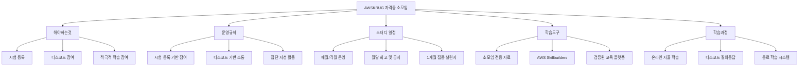
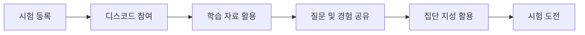
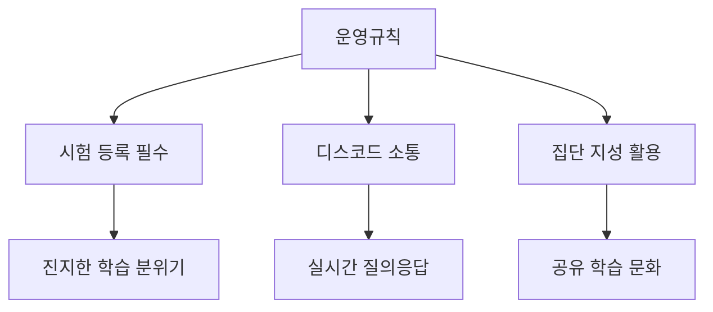
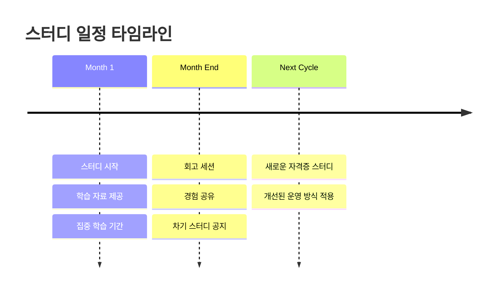
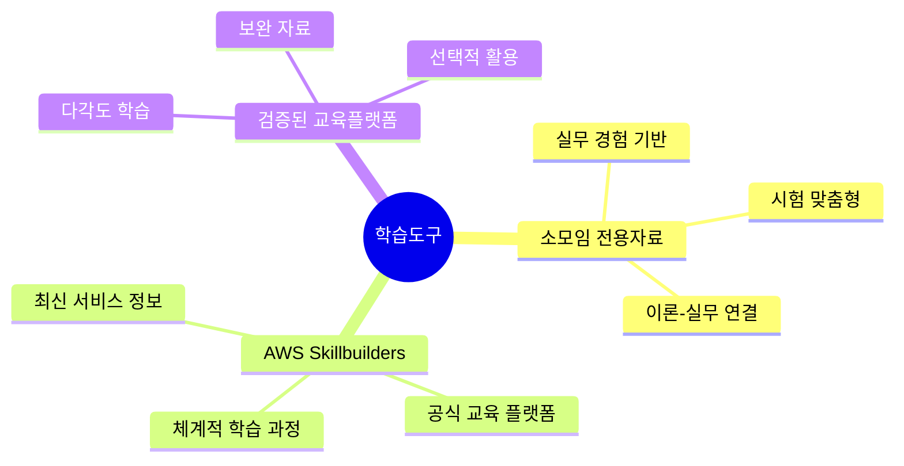
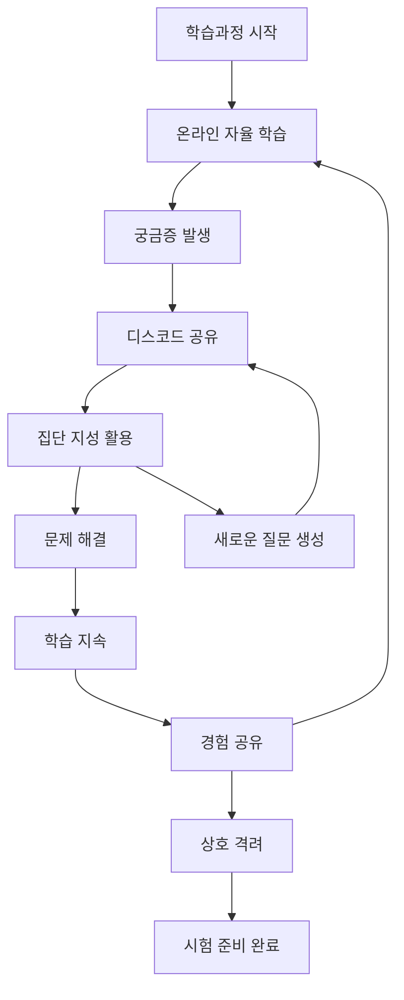

# AWSKRUG 자격증 소모임 운영 가이드

## Overview

## 해야하는것

**시험 등록 및 참여 준비**
자격증 스터디에 참여하기 위해서는 먼저 AWS 자격증 시험을 등록해야 합니다. 이는 단순한 참여 의지를 보여주는 것이 아니라, 실제 목표를 설정하고 구체적인 일정을 잡아 학습에 대한 동기부여를 높이기 위한 필수 조건입니다. 시험 등록 후에는 디스코드 채널에 참여하여 다른 스터디원들과 소통하며 함께 학습 여정을 시작하게 됩니다.

**적극적인 학습 참여**
제공되는 학습 자료를 바탕으로 꾸준히 학습하고, 궁금한 점이나 어려운 개념을 디스코드에 적극적으로 공유해야 합니다. 또한 다른 스터디원들의 질문에 대해서도 자신이 알고 있는 내용을 공유하며, 집단 지성을 통해 함께 성장하는 협력적 학습 태도가 필요합니다.

## 운영규칙

**시험 등록 기반 참여 원칙**
우리 소모임의 핵심 운영 원칙은 '실제 시험에 도전하는 사람들만이 참여할 수 있다'는 것입니다. 이는 진지한 학습 분위기를 조성하고, 서로에게 동기부여가 되는 환경을 만들기 위함입니다. 단순히 관심만 있는 분들보다는 실제 자격증 취득이라는 구체적인 목표를 가진 분들과 함께 하고자 합니다.

**디스코드 기반 소통 체계**
모든 공지사항, 학습 자료 공유, 질의응답, 스터디원 간의 소통은 디스코드 플랫폼을 통해 이루어집니다. 이를 통해 실시간 소통이 가능하고, 학습 과정에서 발생하는 다양한 궁금증을 즉시 공유하고 해결할 수 있는 환경을 제공합니다.

**집단 지성 기반 학습 문화**
궁금한 점이나 어려운 개념은 개별적으로 해결하기보다는 디스코드에 공유하여 모든 스터디원들이 함께 학습할 수 있도록 합니다. 이를 통해 한 사람의 질문이 전체의 학습 향상으로 이어지는 선순환 구조를 만들어갑니다.

## 스터디 일정

**정기적인 스터디 운영 주기**
스터디는 매월 또는 격월로 정기적으로 운영됩니다. 이러한 규칙적인 주기는 참여자들이 지속적으로 학습 동기를 유지할 수 있도록 도와주며, 장기적인 관점에서 AWS 역량을 체계적으로 쌓아갈 수 있게 합니다.

**회고 및 차기 계획 수립**
각 스터디가 시작된 다음 달 말에는 반드시 회고 시간을 갖습니다. 이 시간을 통해 스터디 진행 과정에서의 성과와 아쉬웠던 점들을 공유하고, 개선점을 찾아 다음 스터디에 반영합니다. 동시에 차기 스터디 주제와 일정을 공지하여 연속성 있는 학습이 이어질 수 있도록 합니다.

**1개월 집중 챌린지**
우리 소모임의 특별한 점은 1달 이내 시험을 보는 것을 목표로 하는 집중적인 챌린지 방식입니다. 이는 짧은 시간 내에 높은 집중도로 학습하여 효과적인 결과를 얻을 수 있도록 설계된 것입니다.

## 학습도구

**소모임 전용 학습 자료**
자격증 소모임에서는 오거나이저들이 직접 준비한 전용 학습 자료를 제공합니다. 이 자료들은 실제 시험 경험과 AWS 실무 경험을 바탕으로 제작되어, 이론과 실무를 연결하여 이해할 수 있도록 구성되어 있습니다.

**AWS Skillbuilders 활용**
공식 AWS 교육 플랫폼인 AWS Skillbuilders를 적극 활용합니다. 이를 통해 최신 AWS 서비스와 기능에 대한 정확한 정보를 습득하고, 공식 교육 콘텐츠를 통해 체계적인 학습이 가능합니다.

**기타 검증된 교육 플랫폼**
필요에 따라 다양한 온라인 교육 플랫폼의 검증된 콘텐츠들도 활용하여, 참여자들이 다각도로 학습할 수 있는 환경을 제공합니다.

## 학습과정

**온라인 기반 자율 학습 환경**
모든 스터디는 온라인으로 진행되어 지역적 제약 없이 누구나 참여할 수 있습니다. 참여자들은 제공된 학습 자료를 바탕으로 자신의 속도에 맞춰 학습을 진행하며, 필요에 따라 추가적인 학습 리소스를 활용할 수 있습니다.

**디스코드 기반 집단 지성 활용**
학습 과정에서 발생하는 궁금증이나 어려운 개념은 디스코드에 공유하여 전체 스터디원들의 집단 지성을 활용합니다. 한 사람의 질문이 모든 참여자의 학습 향상으로 이어지며, 서로의 경험과 지식을 공유하여 더욱 풍부한 학습 경험을 만들어갑니다.

**동료 학습 및 상호 지원**
디스코드를 통한 지속적인 소통으로 스터디원들 간의 질의응답, 경험 공유, 상호 격려가 이루어집니다. 이러한 동료 학습 시스템은 개인 학습의 한계를 극복하고, 더 풍부한 학습 경험을 제공합니다.

